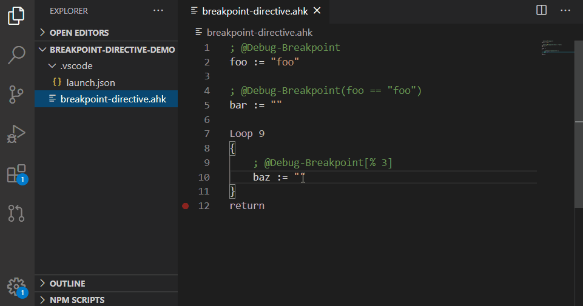
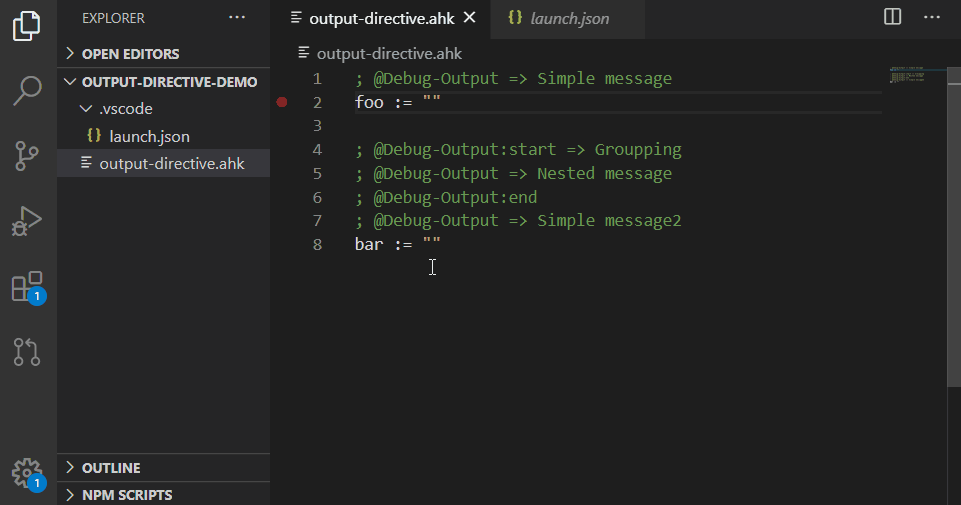

**Translated by [DeepL Tranlator](https://www.deepl.com/translator)**

# TOC
* [Before reading](#before-reading)
* [News](#news)
* [Overview](#overview)
* [Installation](#installation)
* [Usage](#usage)
* [Customize launch.json](#customize-launchjson)
* [MetaVariable](#metavariable) ***NEW***
* [Features](#features)
    * [Data inspection](#data-inspection)
    * [Call stack](#call-stack)
    * [Watch expression](#watch-expression)
    * [Loaded scripts](#loaded-scripts)
    * [Breakpoint](#breakpoint)
    * [Advanced breakpoint](#advanced-breakpoint)
        * [Conditional breakpoint](#conditional-breakpoint)
        * [Hit conditional breakpoint](#hit-conditional-breakpoint)
        * [Log point](#log-point)
    * [IntelliSense in debugging](#intellisense-in-debugging) ***NEW***
    * [Debug console](#debug-console)
    * [PerfTips (Optional)](#perftips-optional) ***NEW***
    * [Debug directive (Optional)](#debug-directive-optional)
        * [Breakpoint directive](#breakpoint-directive) ***NEW***
        * [Output directive](#output-directive) ***NEW***
* [Known issues](#known-issues)
* [Development support](#development-support)

# Before reading
* **This extension will not work alone.**
A separate extension that supports the AutoHotkey language is required(The most famous is [slevesque.vscode-autohotkey](https://marketplace.visualstudio.com/items?itemName=slevesque.vscode-autohotkey)). If you are using AutoHotkey v2, another extension that supports it required. (e.g. [dudelmoser.vscode-autohotkey2](https://marketplace.visualstudio.com/items?itemName=dudelmoser.vscode-autohotkey2))

* Before you update, please look at the [News](#news) below this first. It may contain important information. Also, there may be a fatal bug in the new version. If this is the case, please refer to [CHANGELOG](CHANGELOG.md) to downgrade it

* If you want to know what the next version of the plan is, check out the [milestones](https://github.com/zero-plusplus/vscode-autohotkey-debug/milestones). Also if you want to see the latest progress, you can check the [commit history](https://github.com/zero-plusplus/vscode-autohotkey-debug/commits/develop) of the develop branch

* If you're interested in supporting the development(bug reports, sponsorship, etc.), look [here](#development-support). **Note: Pull Request is not accepted**

# News

### Important Notices
* From `1.6.0`, `Advanced output` has been removed. This was not a feasible feature. Please use [Output directive](#output-directive) instead

* From `1.6.0`, [Advanced breakpoint](#advanced-breakpoint) will always be enabled. This is due to the fact that if you don't set it on the UI, it won't affect performance, and step execution has been improved and is no longer forced to stop. `useAdvancedBreakpoint` has been removed accordingly

### Update
* `1.7.1` - 2021-08-17
    * Fixed: [#118](https://github.com/zero-plusplus/vscode-autohotkey-debug/issues/118) `Copy Value` does not work in Variables View

* `1.7.0` - 2021-08-17
    * Added: [#54](https://github.com/zero-plusplus/vscode-autohotkey-debug/issues/54) `useAutoJumpToError` to launch.json

* `1.6.14` - 2021-07-27
    * Fixed: [#112](https://github.com/zero-plusplus/vscode-autohotkey-debug/issues/112) AutoHotkey2-beta.1 does not set `/ErrorStdOut=UTF-8` automatically

See [CHANGELOG](CHANGELOG.md) for details.

# Overview
This extension was designed to be upwardly compatible with the SciTE4AutoHotkey debug adapter.
So you can use all of it's features as well as new features such as [Conditional breakpoint](#conditional-breakpoint).
It also runs asynchronously, so it runs very fast. Best of all, VSCode's debug UI is great!

See [Features](#features) for details.

### Unsupported
The following features cannot be implemented due to specifications.
* Attach to a running script

### About AutoHotkey_H
I'm not familiar with [AutoHotkey_H](https://hotkeyit.github.io/v2/), but like AutoHotkey, it uses [DBGP](https://xdebug.org/) and should be able to be debugged without problems.
However, the implementation is a bit different, so there may be some inherent bugs that may occur.

If you find a bug, please report it to [issues](https://github.com/zero-plusplus/vscode-autohotkey-debug/issues).

# Installation
1. Install [Visual Studio Code](https://code.visualstudio.com/) with version `1.45.0` or higher
2. Install [AutoHotkey](https://www.autohotkey.com/)
3. Install an extension to support AutoHotkey (the famous `slevesque.vscode-autohotkey`)
4. Press `Ctrl + P`, type `ext install zero-plusplus.vscode-autohotkey-debug`

If you want to use AutoHotkey v2, or AutoHotkey_H edit the `runtime` in [launch.json](#customize-launchjson).

# Usage
1. Open a file with the extension `.ahk`, `.ahk2` or `.ah2`.
2. Set [Breakpoint](#breakpoint) where you want them
3. Press `F5`

If you want to run without debugging, choose `Run -> Run Without Debugging` from the menu or press `Ctrl + F5`.

# Customize launch.json
If you want to change the settings of the debugger adapter, you need to edit the `launch.json`.
You can learn the basics of `launch.json` [here](https://code.visualstudio.com/docs/editor/debugging#_launch-configurations).
If the default settings are sufficient for you, you don't need to see this section.

It is highly recommended that you learn about [VSCode's variables](https://code.visualstudio.com/docs/editor/variables-reference) before setting them up. It is sufficient to understand the following variables.
* `${file}` :　It will be replaced with the path of the currently open file
* `${workspaceFolder}` :　It will be replaced with the path of the folder opened in the VS code

## Basic settings
<table>
<tr>
    <th>Name</th>
    <th>Type</th>
    <th>Description</th>
</tr>
<tr>
    <td>name</td>
    <td>string</td>
    <td>
        The name of the settings. I recommend giving it a unique and easily understood name.<br />
        <strong>default: <code>"AutoHotkey Debug"</code></strong>
    </td>
</tr>
<tr>
    <td>type</td>
    <td>string</td>
    <td>Specify <code>"autohotkey"</code>. This is like the ID of the debug adapter to run. So its value is fixed.</td>
</tr>
<tr>
    <td>request</td>
    <td>string</td>
    <td>Specify <code>"launch"</code>. VSCode also supports <code>"attach"</code>, but this extension does not support it. So its value is fixed.</td>
</tr>
<tr>
    <td>runtime</td>
    <td>string</td>
    <td>
        The path to AutoHotkey.exe. If you specify a relative path, the current directory is <code>C:/Program Files/AutoHotkey</code>. Also extension(i.e. <code>.exe</code>) is optional.<br />
        e.g. <code>"v2/AutoHotkey.exe"</code>, <code>"${workspaceFolder}/AutoHotkey"</code>
    </td>
</tr>
<tr>
    <td>runtime_v1<br />runtime_v2</td>
    <td>string</td>
    <td>
        Same as <code>runtime</code>, but useful if you want to specify different settings for different extensions. <code>runtime_v1</code> corresponds to <code>.ahk</code> and <code>runtime_v2</code> corresponds to <code>.ahk2</code> or <code>.ah2</code>. If the <code>runtime</code> is set, it takes precedence.<br />
        <strong>default: <code>"AutoHotkey.exe"</code>, <code>"v2/AutoHotkey.exe"</code></strong>
    </td>
</tr>
<tr>
    <td>runtimeArgs</td>
    <td>arary</td>
    <td>
        <strong>Most people don't need to change this setting. If you set it wrong, debugging may fail.</strong><br /><br />
        Arguments to pass to AutoHotkey.exe. You can see a description of the argument <a href="https://www.autohotkey.com/docs/Scripts.htm#cmd">here</a>, described as a Switch. However <code>"/debug"</code> will be ignored.<br />
        <strong>default:<code>[ "/ErrorStdOut" ]</code></strong>. If possible <strong><code>[ "/ErrorStdOut=UTF-8"]</code></strong>.
    </td>
</tr>
<tr>
    <td>runtimeArgs_v1<br />runtimeArgs_v2</td>
    <td>array</td>
    <td>
        Same as <code>runtimeArgs</code>, but useful if you want to specify different settings for different extensions. <code>runtimeArgs_v1</code> corresponds to <code>.ahk</code> and <code>runtimeArgs_v2</code> corresponds to <code>.ahk2</code> or <code>.ah2</code>.
    </td>
</tr>
<tr>
    <td>port</td>
    <td>number</td>
    <td>
        A port to be assigned to the debugger. Basically, you don't need to change it, but if you want to debug more than one at the same time, you need to set different ports for each.<br />
        <strong>default: <code>9002</code></strong>
    </td>
</tr>
<tr>
    <td></td>
    <td>string</td>
    <td>
        If a port is already in use, a confirmation message will appear asking if you want to use a different port. If this message is annoying, you can give the debug adapter permission to use the port using the <code>"start-end"</code> format.
<br />
        e.g. <code>"9002-9010"</code>
    </td>
</tr>
<tr>
    <td>program</td>
    <td>string</td>
    <td>
        The absolute path to the script you want to debug.<br />
        <strong>default: <code>"${file}"</code><strong>
    </td>
</tr>
<tr>
    <td>args</td>
    <td>array</td>
    <td>Arguments to be passed to <code>program</code></td>
</tr>
<tr>
    <td>env</td>
    <td>object</td>
    <td>
        Environment variable to be set during debugging. if set to <code>null</code>, it will be treated as an empty string.
    </td>
</tr>
<tr>
    <td>stopOnEntry</td>
    <td>boolean</td>
    <td>
        If <code>false</code>, it runs until it break at a breakpoint. Set it to <code>true</code> if you want it to stop at the first line, as in SciTE4AutoHotkey.<br />
        <strong>default: <code>false</code><strong>
    </td>
</tr>
<tr>
    <td>maxChildren</td>
    <td>number</td>
    <td>
        The maximum number of child elements of the object to be retrieved. Basically, there is no need to change it.<br />
        <strong>default: <code>10000</code><strong>
    </td>
</tr>
<tr>
    <td>openFileOnExit</td>
    <td>string</td>
    <td>
        The absolute path of the script you want to open when the debugging is finished. This is useful if you want to quickly edit a specific script.<br />
        e.g. <code>"${file}"</code>
    </td>
</tr>
<tr>
    <td>useAutoJumpToError</td>
    <td>boolean</td>
    <td>
        Open the error source when debugging is terminated due to an <b>load-time error</b>. If you want it to work even with run-time errors, you need to use <a href="https://gist.github.com/zero-plusplus/107d88903f8cb869d3a1600db51b7b0a">this library</a>.<br />
        This takes precedence over <code>openFileOnExit</code>.<br />
        <strong>default: <code>false</code><strong>
    </td>
</tr>
</table>

## Advanced settings
<table>
<tr>
    <th>Name</th>
    <th>Type</th>
    <th>Description</th>
</tr>
<tr>
    <td>useIntelliSenseInDebugging</td>
    <td>boolean</td>
    <td>
        Enable / disable <a href="#intellisense-in-debugging">IntelliSense in Debugging</a>. If you have installed another extension that supports IntelliSense, it is recommended to disable this feature.<br />
    <strong>default: <code>true</code></strong>
    </td>
</tr>
<tr>
    <td>usePerfTips</td>
    <td>boolean</td>
    <td>
        Enable / disable <a href="#perftips-optional">PerfTips</a>.<br />
        <strong>default: <code>false</code></strong>
    </td>
</tr>
<tr>
    <td></td>
    <td>string</td>
    <td>
        Short hand for setting only <code>.format</code>.<br />
        e.g. <code>"{{elapsedTime_s}}s elapsed."</code>
    </td>
</tr>
<tr>
    <td></td>
    <td>object</td>
    <td>
        Advanced settings. See the following properties for details.
    </td>
</tr>
<tr>
    <td><code>format</code></td>
    <td>string</td>
    <td>
        Content to be displayed. See the Log point's <a href="#embedding-value">Embedding value</a> for instructions on how to embed the variables.<br />
        e.g. <code>"{{elapsedTime_s}}s elapsed."</code>
    </td>
</tr>
<tr>
    <td><code>fontColor</code></td>
    <td>string</td>
    <td>
        Set the <a href="https://developer.mozilla.org/en-US/docs/Web/CSS/color">color</a> of CSS.<br />
        e.g. <code>"gray"</code>
    </td>
</tr>
<tr>
    <td><code>fontStyle</code></td>
    <td>string</td>
    <td>
        Set the <a href="https://developer.mozilla.org/en-US/docs/Web/CSS/font-style">font-style</a> of CSS.<br />
        e.g. <code>"italic"</code>
    </td>
</tr>
<tr>
    <td>useDebugDirective</td>
    <td>boolean</td>
    <td>
        <strong>Note that if you enable, debug startup is slow.</strong><br /><br />
        Enable / disable <a href="#debug-directive-optional">Debug directive</a>.<br />
        <strong>default: <code>false</code></strong>
    </td>
</tr>
<tr>
    <td></td>
    <td>object</td>
    <td>Advanced settings. See the following properties for details.</td>
</tr>
<tr>
    <td><code>useBreakpointDirective</code></td>
    <td>boolean</td>
    <td>Enable / disable <a href="#breakpoint-directive">Breakpoint directive</a>.</td>
</tr>
<tr>
    <td><code>useOutputDirective</code></td>
    <td>boolean</td>
    <td>Enable / disable <a href="#output-directive">Output directive</a>.</td>
</tr>
</table>

# MetaVariable
Sometimes the debugger adapter holds more useful information than the AutoHotkey debugger. You can access these data by using `MetaVariable`.

As with AutoHotkey's variable name, this is case insensitive. And to distinguish it from that, the name of the `MetaVariable` is enclosed in curly brackets. e.g. `{hitCount}`

The following features allow to handle `MetaVariable`.
* [Watch expression](#watch-expression)
* [Log point](#log-point)
* [PerfTips](#perftips-optional)
* [Debug directive](#debug-directive-optional)
    * [Breakpoint directive](#breakpoint-directive)
    * [Output directive](#output-directive)

<table>
<tr>
    <th>Name</th>
    <th>Description</th>
</tr>
<tr>
    <td>{hitCount}</td>
    <td>
        Hit count of <a href="#breakpoint">Breakpoint</a>. If the <a href="#about-stop-reason">stop reason</a> is not <code>BREAKPOINT</code> or <code>HIDDEN BREAKPOINT</code>, the value will be <code>-1</code>.<br />
        Removing a breakpoint will also discard the count.
    </td>
</tr>
<tr>
    <td>
        {elapsedTime_ns}<br />
        {elapsedTime_ms}<br />
        {elapsedTime_s}
    </td>
    <td>
        <strong>Note that this is not accurate by specification, Especially noticeable if you are using <a href="#advanced-breakpoint">Advanced breakpoint</a>. Also note that if you pause, the value will be <code>-1</code>, as the exact execute time cannot be calculated.</strong><br /><br />
        Time taken to execute. Each suffix indicates the unit of measurement: <code>ns</code>(nanosecond), <code>ms</code>(millisecond), <code>s</code>(second).
    </td>
</tr>
</table>

# Features
## Data inspection


You can check the data of the variables. Also check the type name by hovering over the variable name.

If the variable is an object, the value is a `ClassName` and summary of its children. e.g. `ClassName {field: "value"}`, `Object(3) [1, 2, 3]`

You can click on it to see its children. The max number of child elements can be set by `maxChildren` in [launch.json](#customize-launchjson).

 `ClassName` is used in the `is` operator for [Conditional breakpoint](#conditional-breakpoint). Note that this name is what the debug adapter is aware of and may be different from the `__Class` field.

#### About VariableName
If you see `VariableName` in this document, it's the name of the variable displayed by this feature. It is case insensitive.

The object's child elements are the same as in the running script, and can be specified in dot notation(e.g. `object.field`) or bracket notation(e.g. `array[1]`). Which notation is available depends on the version of AutoHotkey, v1 can use either notation.

In the case of bracket notation, the `VariableName` can be specified such as `map2[map[object.field]]`.

#### About A_DebuggerName
This is a variable that is only set when you are debugging, and also in SciTE4AutoHotkey. By using this variable, you can write code that only runs during debugging. **However, please note the following when using this variable.**

This variable is not a [SuperGlobal variable](https://www.autohotkey.com/docs/Functions.htm#SuperGlobal), unlike the other built-in variables, due to a specification issue. I recommend adding the following code to the [Auto-execute Section](https://www.autohotkey.com/docs/Scripts.htm#auto) to elevate it to SuperGlobal variable.
```ahk
global A_DebuggerName := A_DebuggerName ; Elevated to SuperGlobal
```

If using AuotHotkey v2.
```ahk
if (IsSet(A_DebuggerName)) {
  global A_DebuggerName := A_DebuggerName ; Elevated to SuperGlobal
}
```

### Rewriting variables


**Note that in v2, a critical error will force the script to stop if you rewrite the [dynamic property](https://lexikos.github.io/v2/docs/Objects.htm#Custom_Classes_property).**

The following values are supported. Object is not supported by the specification.
* `String` :　e.g `"foo"`

* `Number`

    * `Integer` :　e.g. `123`

    * `Float` :　v1 treats it as a string, v2 treats it as a `Float`. e.g. `123.456`

    * `Hex` :　It will be converted to decimal before writing. That is, if the value is `0x123`, it is written as `291`. The type is treated as `Integer` e.g. `0x123`

    * `Scientific` :　In v1, it is treated as a string
On v2, it is converted to `Float`. So, `3.0e3` is written as `3000.0`. e.g. `3.0e3`, `3.0e+5`.

### Data inspection when hover


You can see the data by hovering over the name of the variable. Also see the values of the object's child elements, only support in dot notation(e.g. `object.field`). Bracket notation(e.g. `array[1]`) is not supported.

## Call stack


You can see the current call stack.
Also click to display the variables of that hierarchy in the [Data inspection](#data-inspection).

### About stop reason
You can also see why the script was stopped. This information may not be very useful, but I'll use it to explain it, so I'll document it.

There are three stop reasons.
* PAUSE
* STEP
* BREAKPOINT
* HIDDEN BREAKPOINT

`HIDDEN BREAKPOINT` is a [Breakpoint](#breakpoint) set by the [Breakpoint directive](#breakpoint-directive).

## Watch expression


You can monitor the value of a variable. Expressions are not supported.

In addition to [VariableName](#about-variablename), you can monitor [MetaVariable](#metavariable).
Therefore, it can be used as a substitute for [PerfTips](#perftips-optional).

## Loaded scripts


You can see the external script being loaded.

It supports both explicit loading using [#Include](https://www.autohotkey.com/docs/commands/_Include.htm) and implicit loading using [function libraries](https://www.autohotkey.com/docs/Functions.htm#lib).

## Breakpoint
You can learn the basics of breakpoint [here](https://code.visualstudio.com/docs/editor/debugging#_breakpoints)

## Advanced breakpoint
**Note that using this feature for large loops will greatly degrade performance.**

See [here](https://code.visualstudio.com/docs/editor/debugging#_advanced-breakpoint-topics) for the basics.

### Unsupported
* [Inline breakpoint](https://code.visualstudio.com/docs/editor/debugging#_inline-breakpoints) :　It's impossible to implement at the moment
* [Function breakpoint](https://code.visualstudio.com/docs/editor/debugging#_function-breakpoints) :　There are plans to implement. However, time is needed
* [Data breakpoint](https://code.visualstudio.com/docs/editor/debugging#_data-breakpoints) :　It's impossible to implement at the moment

### Conditional breakpoint


#### Condition expresion
I am not familiar with the parser and evaluation of expressions, so this is a minimal implementation.

##### Grammer
```md
# The inside of `[]` can be omitted.

Expression1 [LogicalOperator1 Expression2, LogicalOperator2 Expression3...]
```

e.g.
* `A_Index == 30`
* `20 <= person.age`
* `person.name ~= "i)J.*"`
* `100 < countof list`
* `variable is "string"`
* `object is "object:Func"`
* `instance is ClassObject`
* `"field" in Object`, `keyName not in Object`
* `object is Fowl || "wing" in object && "beak" in object`

##### Rules
* `Expression` :　`Operand [Operator Operand]`

* `Operand` :　`VariableName` or `Primitive`

* `VariableName` :　See [VariableName](#about-variablename) for details. e.g. `variable`, `object.field`, `object["spaced key"]`, `array[1]`, `map[key]`

* `MetaVariableName` :　See [MetaVariable](#metavariable) for details. e.g. `{hitCount}`

* `Primitive` :　Primitive values for AutoHotkey. e.g. `"string"`, `123`, `123.456`, `0x123`, `3.0e3`

* `Operator`

    * Prefix operators :　 Unlike other operators, it is specify before `Operand`. Note that it is not case sensitive and requires at least one trailing space. e.g. `countof list`

        * `countof` :　If `Operand` is a primitive value, the number of characters is returned. In the case of an object, it returns the number of elements. However, in the case of an array, it returns the length

    * Logical operators :　Specify `Expression` on the left and right

        * `&&` :　Returns false if the left expression is false. If not, return right

        * `||` :　Returns true if the left expression is true. If not, return right

    * Comparison operators :　Specify `Operand` on the left and right. The `is` or `in` operator must have at least one space before and after it

        * `=` :　Compares two values in a case insensitive

        * `==` :　Compares two values in a case sensitive

        * `!=` :　Negative of `=` operator

        * `!==` :　Negative of `==` operator

        * `~=` :　Compares with [AutoHotkey like RegEx](https://www.autohotkey.com/docs/misc/RegEx-QuickRef.htm) or [Javascript RegExp](https://developer.mozilla.org/en-US/docs/Web/JavaScript/Guide/Regular_Expressions). e.g. `name ~= "i)j.*"`, `name ~= /j.*/i`
            * **Note** :　`AutoHotkey like RegEx` is not the same as a pure AutoHotkey regular expression(PCRE). Convert PCRE to a JavaScript RegExp using [pcre-to-regexp](https://www.npmjs.com/package/pcre-to-regexp). This means that PCRE-specific features such as (?R) are not available

        * `!~` :　Negate of `~=` operator

        * `>` :　Greater than

        * `>=` :　Greater than or equal

        * `<` :　Less than

        * `<=` :　Less than or equal

        * `is [not]` :　Checks if the value is of a particular type or if it inherits from a particular class. The left side is specified with `VariableName`. The right side specifies the following values. It is case-insensitive

            * The five basic types are as follows. These can be checked by hovering over the variable names in [Data inspection](#data-inspection). e.g. `variable is "string"`, `variable is not "undefined"`

                * `"undefined"` :　Check for uninitialized variable

                * `"string"` :　e.g. `"str"`

                * `"integer"` or `"int"` :　e.g. `123`

                * `"float"` :　e.g. `123.456`

                * `"object"` :　All values other than the primitive values. e.g. `{}`, `[]`

            * Composite types. e.g. `variable is "number"`

                * `"number"` :　Composite types of `integer` and `float`

                * `"primitive"` :　Composite types of `string`, `integer` and `float`

            * More detailed type check. e.g. `variable is "number:like"`, `variable is not "object:Func"`

                * `"string:alpha"` :　Checks if it consists of only the alphabet. Same as `variable ~= "^[a-zA-Z]$"`

                * `"string:alnum"` :　Checks if it consists of only the alphabet and numbers. Same as `variable ~= "^[a-zA-Z0-9]+$"`

                * `"string:hex"` :　Checks if the value is in hexadecimal. Same as `variable ~= "^0x[0-9a-fA-F]+$"`

                * `"string:upper"` :　Checks if it consists of only the alphabet of uppercase. Same as `variable ~= "^[A-Z]+$"`

                * `"string:lower"` :　Checks if it consists of only the alphabet of lowercase. Same as `variable ~= "^[a-z]+$"`

                * `"string:space"` :　Checks if it consists of only the white space characters. Same as `variable ~= "^\s+$"`

                * `"string:time"` : 　Checks if it can be interpreted as a date. A date is a string of characters that can be parsed by [Data.parse](https://developer.mozilla.org/en-US/docs/Web/JavaScript/Reference/Global_Objects/Date/parse). e.g. `2000-1-1 00:00:00`

                * `"integer:like"` or `"int:like"` :　Checks if the value can be converted to an `integer` or an pure `integer`. e.g. `123`, `"123"`

                * `"float:like"` or `"int:like"` :　Checks if the value can be converted to a `float` and not `integer`, or a pure `float`. Returns false if the value is an `integer`. e.g. `123.456`, `"123.456"`

                * `"number:like"` :　Composite types of `integer:like` and `float:like`

                * `"object:ClassName"` :　Checks whether an object is a particular `ClassName`. You can check the `ClassName` by looking at the value of the variable holding the object in [Data inspection](#data-inspection)(e.g. `ClassName {...} `). Note that the `ClassName` here is not the same as the value of the `__class` field

            * `VariableName` :　Checks if the class inherits from a specific class. The value of the variable must be an class object. e.g. `instance is ClassObject`

        * `[not] in` :　Check if the object owns or inherits a particular field. Left side is `Primitive` or `VariableName`, and the right side is `VariableName`. e.g. `"key" in Object`, `"key" not in Object`

### Hit conditional breakpoint


Break the script when the breakpoint reaches a certain hit count. You can check the current hit count by watching `{hitCount}` in the [Watch expression](#watch-expression) etc.

##### Grammer
It is basically a short hand of conditional breakpoint. However, only the `%` operator will be a unique feature.

```md
# You don't need to enter anything in {}. It is written for the purpose of explanation
# You can omit anything in []

{hitCount} [Operator] Integer
```

e.g. `= 30`, `<= 30`

##### Rules
* `hitCount` It is the same as the [MetaVariable](#metavariable)'s `{hitCount}`

* `Operator` If omitted, it is equivalent to `>=`

    * `= or ==` :　Same as `{hitCount} == Integer` by [Conditional breakpoint](#conditional-breakpoint)

    * `>` :　Same as `{hitCount} > Integer` by [Conditional breakpoint](#conditional-breakpoint)

    * `>=` :　Same as `{hitCount} >= Integer` by [Conditional breakpoint](#conditional-breakpoint)

    * `<` :　Same as `{hitCount} < Integer` by [Conditional breakpoint](#conditional-breakpoint)

    * `<=` :　Same as `{hitCount} <= Integer` by [Conditional breakpoint](#conditional-breakpoint)

    * `%` :　Same as `Mod(hitCount, Integer) == 0` by [AutoHotkey](https://www.autohotkey.com/docs/commands/Math.htm#Mod)

* `Integer` :　e.g. `30`

### Log point


This feature unlike [Breakpoint](#breakpoint) do not break the script. Instead, they output a message to the [Debug console](#debug-console).

What makes them different from traditional log output is that you don't have to modify your script. Also, you can embed variable value. See [Embedding value](#embedding-value) for details.

However, you need to use VSCode's UI to use this feature, so some people may prefer to embed logging process in scripts the traditional way.
Debug directive's [Output directive](#output-directive) is useful in this case.

#### Embedding value
You can embed value the [AutoHotkey's variable](#about-variablename) or [MetaVariable](#metavariable) name by enclosing them name in curly brackets. e.g. `count: {A_Index}`, `{object}`, `name: {person.name}`, `{{elapsedTime_s}}`

If the value is an object, it is displayed as a group, like a [Data inspection](#data-inspection). Note that this will be output as a separate message. That is, `{primitive}{object}{primitive}` will output three messages.

If you want to output curly brackets directly, prefix it with `\`. e.g. `\{notVariableName\}`

## IntelliSense in debugging


**Since this feature is achieved using the debugger, it only works during debugging.**

The variables that are displayed in the [Data inspection](#data-inspection) will be suggested. Supports dot notation (e.g. `object.field`) and bracket notation (e.g. `object["field"]`).

If you use suggestion with bracket notation, please note the following
* Like dot notation, it is suggested when you type a `.`, such as `object.`. Otherwise, you need to type up to `object["` and then type `Ctrl + Space`

* If the object key is a number as array, it will not be suggested

* To access more child elements following the bracket notation, specify the key as a primitive value or a [VariableName](#about-variablename). Otherwise, the child element suggestions will not work. e.g. `object["key"].child`, `object[key].child`, `array[1].child`

Note the following additional points for v2 users.
* AutoHotkey error may occur when suggestions a child element of a [dynamic property](https://lexikos.github.io/v2/docs/Objects.htm#Custom_Classes_property). This is caused by the `get` or `set` function of the dynamic property being executed

If you don't need this feature, set `useIntelliSenseInDebugging` to `false` in [launch.json](#customize-launchjson).

## Debug console


Displays various messages during debugging. Press `Ctrl + Shift + y` if you want to use it.

### Message from Debug adapter
Besides the announcements from the debug adapter, you can output messages to the debug console yourself in the following ways.
* [Log point](#log-point)
* [Debug directive](#debug-directive-optional)
    * [Breakpoint directive](#breakpoint-directive)
    * [Output directive](#output-directive)

### Message from AutoHotkey
You can output messages from the script to the debug console in the following ways.
* [FileAppend](https://www.autohotkey.com/docs/commands/FileAppend.htm)
* [FileOpen](https://www.autohotkey.com/docs/commands/FileOpen.htm)
* [OutputDebug](https://www.autohotkey.com/docs/commands/OutputDebug.htm)

### About error message
The debug adapter modifies the format of the file name and line number in the error messages output by AutoHotkey. This allows VSCode to recognize it as a link and allows the user to jump to the source of the error.

However, not all errors are output to the debug console and
If a runtime error occurs, the error message is basically only shown in a dialog box.
This doesn't allow you to jump to the source of the error using a link.

If this is inconvenient for you, you can include [this library](https://gist.github.com/zero-plusplus/107d88903f8cb869d3a1600db51b7b0a) in your scripts.
The library will catch all errors and output a message to the debug console in the same format as the actual error messages.

If you encounter a bug in this library, please comment at the link.

### About Multi-byte garbled characters(or mojibake)
AutoHotkey error messages do not output a multi-byte string well. However, in version `1.1.33.00`, the [#ErrorStdOut](https://www.autohotkey.com/docs/commands/_ErrorStdOut.htm) directive and the [/ErrorStdOut](https://www.autohotkey.com/docs/Scripts.htm#cmd) switch has been extended to allow UTF-8 output, which resolves this issue.

If this feature is available, it is enabled by default and the user does not need to be aware of it. However, if you have set `runtimeArgs`, you need to add `"/ErrorStdOut=UTF-8"` manually.

## PerfTips (Optional)


**Note if you have an extension installed that displays information inline, such as `eamodio.gitlens`, it may be overwritten by that information. Currently, you need to give up one or the other. But [MetaVariable](#metavariable) are also supported by the [Watch expression](#watch-expression), so you can use that instead.**

Available when `usePerfTips` is setting. See [here](#customize-launchjson) for details.

As with [Visual Studio's PerfTips](https://docs.microsoft.com/en-us/visualstudio/profiling/perftips?view=vs-2019), when debugging is break, the current line displays the execute time.

**Please note that the execute time displayed are not exact. See `{elapsedTime_s}` in [MetaVariable](#metavariable) for details**

## Debug directive (Optional)
**This is a preview version. Specifications are subject to change. Also need to search for directive comments slows down performance at startup.**

You can send commands to the debugger adapter by embedding special comments into the script.
This feature is achieved using [Advanced breakpoint](#advanced-breakpoint). So knowledge of it may be required.

Each directive can be configured with the following rules.
```md
# Capitalization indicates the part that can be setting. Basically, it can be omitted.
# Only spaces are allowed before directive comment.

; @Debug-COMMAND:PARAM1:PARAM2:PARAM3...(CONDITION)[HITCONDITION] => MESSAGE
```

* `COMMAND`
    * `Breakpoint` :　See [Breakpoint directive](#breakpoint-directive)
    * `Output` :　See [Output directive](#output-directive)

* `PARAM` :　Parameters for the command. Each is described in its own section

* `CONDITION` :　See [Conditional breakpoint](#conditional-breakpoint)

* `HITCONDITION` :　See [Hit conditional breakpoint](#hit-conditional-breakpoint)

* `=>` :　Output operator
    * `->` :　Outputs the `MESSAGE` as it is
    * `=>` :　A line feed code is placed at the end of the `MESSAGE`
    * `->|` or `=>|` :　The same as for each operator, but it suppresses the automatic removal of leading whitespace

* `MESSAGE` :　See Log point's [Embedding value](#embedding-value)

### Breakpoint directive


Set a `Hidden breakpoint` in the position of the directive. Unlike [Breakpoint](#breakpoint), it is not displayed in the UI and cannot be changed.
```md
; @Debug-Breakpoint(CONDITION)[HITCONDITION] => MESSAGE
```

e.g. `; @Debug-Breakpoint(20 < person.age) => {person.name}`

### Output directive


Similar to the [Breakpoint directive](#breakpoint-directive), but limited to [Log point](#log-point). Instead, a grouping feature has been added.
```md
; @Debug-Output:GROUPING(CONDITION)[HITCONDITION] => MESSAGE
```

e.g.
```md
; @Debug-Output:start => {person.name}
; @Debug-Output => name: {person.name}
; @Debug-Output => age: {person.age}
; @Debug-Output:end
```

#### PARAM
1. `GROUPPING` :　You can group the output. **Be sure to ungroup with `end` as this will affect all subsequent outputs**
    * `start` :　Starting a new group
    * `startCollapsed` :　Same as `start`, but the created groups will be collapsed
    * `end` :　Ending the group

# Known issues
* [Data inspection](#data-inspection) bug. Arrays with a length of 101 or more are chunked into 100 elements each. It is a specification that these headings will be displayed as `[0..99]`. The AutoHotkey array starts at 1 and should be `[1..100]`, but I can't find a way to change the headings, so I can't solve this problem at the moment

* If more than one information is displayed on the call stack, the file path and line number information for the bottommost information (i.e. `Auto-execute thread` or `Timer thread`) is incorrect

##  v2 only bug
* ~~An error occurs when try to overwrite [dynamic property](https://lexikos.github.io/v2/docs/Objects.htm#Custom_Classes_property) in the [Data inspection](#data-inspection)~~ Fixed in [AutoHotkey-v2-a136](https://www.autohotkey.com/boards/viewtopic.php?f=37&t=2120&sid=e7d43fe09e912b95ab2d1747a47f8bad&start=80#p401370)

* [#105](https://github.com/zero-plusplus/vscode-autohotkey-debug/issues/105) Breakpoints on lines with [Fat arrow function](https://lexikos.github.io/v2/docs/Variables.htm#fat-arrow) assigned to variable do not work

# Development support
## About source code contributes
I am currently not accepting contributions (Pull Request).

I understand that this is a folly to throw away the strength of open-source software, but I believe that I should do all the implementation because the development of this extension includes the purpose of measuring my skills as a programmer.

However, suggestions are welcome. Let's make this extension even better together!

## About bug reports and feature requests
If you find a bug, look at [Known issues](#known-issues) first.

Bugs that are not listed there and feature requests  there are accepted on [Github issues](https://github.com/zero-plusplus/vscode-autohotkey-debug/issues) (Github account required).

Basically, I will reply to you by the same day or the next day, so feel free to report.

## About GitHub Sponsors
If you like it, please [donate or sponsor](https://github.com/sponsors/zero-plusplus) (Github account required).

I have not set a reward to concentrate on development. Thank you for your understanding.
