# TOC
* [Before reading](#before-reading)
* [News](#news)
* [Overview](#overview)
* [Installation](#installation)
* [Usage](#usage)
* [Customize launch.json](#customize-launch.json)
* [MetaVariable](#metavariable) ***NEW***
* [Features](#features)
    * [Data inspection](#data-inspection)
    * [Call stack](#call-stack)
    * [Watch expression](#watch-expression)
    * [Loaded scripts](#loaded-scripts)
    * [Breakpoint](#breakpoint)
        * [Conditional breakpoint](#conditional-breakpoint)
        * [Hit Conditional Breakpoint](#hit-conditional-breakpoint)
        * [Log point](#log-point)
    * [IntelliSense in Debugging](#intellisense-in-debugging) ***NEW***
    * [Standard output](#standard-output)
    * [PerfTips (Optional)](#perftips-optional) ***NEW***
    * [Debug directive (Optional)](#debug-directive-optional) ***NEW***
        * [Breakpoint directive](#breakpoint-directive) ***NEW***
        * [Output directive](#output-directive) ***NEW***
* [Change log](#change-log)
* [Known issues](#known-issues)
* [Development support](#development-support)

# Before reading
Please read the following first.
* This document has been translated from Japanese to English using DeepL Translate

* **This extension will not work alone.**
A separate extension that supports the AutoHotkey language is required(The most famous is `slevesque.vscode-autohotkey`). If you are using AutoHotkey v2, another extension that supports it required. (e.g. `dudelmoser.vscode-autohotkey2`)

* Before you update, please look at the [News](#news) below this first. It may contain important information. Also, there may be a fatal bug in the new version. If this is the case, please refer to [CHANGELOG](CHANGELOG.md) to downgrade it

* If you want to know what the next version of the plan is, check out the [milestones](https://github.com/zero-plusplus/vscode-autohotkey-debug/milestones)

* To support the developers (bug reports, sponsorship, etc.), see [here](#development-support)

# News
### Important Notices
* Advanced output has been removed. See [here](https://github.com/zero-plusplus/vscode-autohotkey-debug/issues/27) for details. Please use [Output directive](#output-directive) instead

* From `1.6.0`, [Advanced breakpoint](#advanced-breakpoint) will always be enabled. This is due to the fact that if you don't set it on the UI, it won't affect performance, and step execution has been improved and is no longer forced to stop. `useAdvancedBreakpoint` has been removed accordingly

* The specification that [VariableName](#about-variablename) is case sensitive was my mistake, not a spec in the AutoHotkey debugger. This bug was fixed in `1.3.0`, but I wasn't aware of it myself, so the correction was delayed. I'm sorry

### Update
* `1.6.0` - 2020-xx-xx
    * Added: [#13](https://github.com/zero-plusplus/vscode-autohotkey-debug/issues/13) Support `Run Without Debugging`
    * Added: [#28](https://github.com/zero-plusplus/vscode-autohotkey-debug/issues/28) Support [MetaVariable](#metavariable). This is supported by several features
    * Added: [#29](https://github.com/zero-plusplus/vscode-autohotkey-debug/issues/29) Support [PerfTips](#perftips-optional)
    * Added: [#30](https://github.com/zero-plusplus/vscode-autohotkey-debug/issues/30) Support [Debug directive](#debug-directive-optional)
    * Added: [#40](https://github.com/zero-plusplus/vscode-autohotkey-debug/issues/40) Support [IntelliSense in Debugging](#intellisense-in-debugging), which is only available for debugging
    * Changed: [#27](https://github.com/zero-plusplus/vscode-autohotkey-debug/issues/27) Remove Advanced output
    * Changed: [#35](https://github.com/zero-plusplus/vscode-autohotkey-debug/issues/35) The exit code is now always displayed
    * Changed: [#41](https://github.com/zero-plusplus/vscode-autohotkey-debug/issues/41) Remove `useAdvancedBreakpoint`. Advanced breakpoint is enabled by default
    * Changed: [#46](https://github.com/zero-plusplus/vscode-autohotkey-debug/issues/46) Improved step execution when using Advanced breakpoint. This removed the forced stop
    * Fixed: [#32](https://github.com/zero-plusplus/vscode-autohotkey-debug/issues/32) If you set a blank character to a Log point, it will not be paused until re-set it
    * Fixed: [#33](https://github.com/zero-plusplus/vscode-autohotkey-debug/issues/33) Float values do not work properly at Conditional breakpoint
    * Fixed: [#34](https://github.com/zero-plusplus/vscode-autohotkey-debug/issues/34) The pause and force stop don't work after an Advanced breakpoint
    * Fixed: [#37](https://github.com/zero-plusplus/vscode-autohotkey-debug/issues/37) Hit conditional breakpoint's `%` operator is not working
    * Fixed: [#44](https://github.com/zero-plusplus/vscode-autohotkey-debug/issues/44) Loaded scripts are not detected when on #Include line a directory is specified
    * Fixed: [#45](https://github.com/zero-plusplus/vscode-autohotkey-debug/issues/45) Loaded scripts are not detected when on specified  relative path by #Include
    * Fixed: [#49](https://github.com/zero-plusplus/vscode-autohotkey-debug/issues/49) v1 only bug. `undefinedVariable == ""` returns false
    * Fixed: [#50](https://github.com/zero-plusplus/vscode-autohotkey-debug/issues/50) The base field cannot be inspected by a hover
    * Fixed: [#51](https://github.com/zero-plusplus/vscode-autohotkey-debug/issues/51) Error occurs when getting dynamic properties by data inspect, etc
    * Fixed: [#53](https://github.com/zero-plusplus/vscode-autohotkey-debug/issues/53) Setting a string containing `&` and `|` in a conditional breakpoint always returns false
    * Fixed: [#55](https://github.com/zero-plusplus/vscode-autohotkey-debug/issues/55) Chunking doesn't work when a large array is specified in a Watch expression
    * Fixed: Data inspect shows an array of length 1 as `{1: value}`
    * Fixed: If the error code is 0, output category is stderr
    * Fixed: Can't pause with Advanced breakpoint
    * Fixed: Blank line printed when outputting object
    * Fixed: "\{" is output without unescaped in Log point etc

* `1.5.0` - 2020-08-14
    * Added: Operators in conditional breakpoint
        * The following operators are now available
            * `!~`
            * `is`
            * `in`
            * `&&`
            * `||`
            * `countof`
    * Changed: Conditional breakpoint
        * JavaScript RegExp is now available with the `~=` operator
        * Make `VariableName` parsing more accurate
    * Fixed: The exit process fails with some errors
    * Fixed: In some cases, the `<base>` field of an instance cannot be obtained correctly
    * Fixed: Fail to parse hexadecimal numbers starting from 0 as in `0x012` with conditional breakpoints and variable writing, etc
    * Fixed: v1 only bug. Where some variables cannot be obtained with conditional breakpoint and watch expression

* `1.4.10` - 2020-08-03
    * Changed: The object summary to show only the elements that are actually enumerated (i.e. the base property is not shown)
    * Fixed: A bug in data inspect
        * The summary of objects within an object is not displayed correctly. Occurred in 1.4.8
        * Chunking does not work when opening an array of 101 or more in an object. Occurred in 1.4.8

See [CHANGELOG](CHANGELOG.md) for details.

# Overview
This extension was designed to be upwardly compatible with the SciTE4AutoHotkey debug adapter.
So you can use all of it's features as well as new features such as conditional breakpoints.
It also runs asynchronously, so it runs very fast. Best of all, VSCode's debug UI is great!

See [Features](#features) for more information.

### Unsupported
The following features cannot be implemented due to specifications.
* Attach to a running script

### About AutoHotkey_H
It should be possible to debug [AutoHotkey_H](https://hotkeyit.github.io/v2/), but I'm not familiar with it so I can't guarantee it will work.

# Installation
1. Install [AutoHotkey](https://www.autohotkey.com/)
2. Install an extension to support AutoHotkey (the famous ` slevesque.vscode-autohotkey`)
3. Press `Ctrl + P`, type `ext install zero-plusplus.vscode-autohotkey-debug`

# Usage
1. Open a file with the extension `ahk`, `ahk2` or `ah2`.
2. Place the breakpoints where you want them
3. Press `F5`

If you want to run without debugging, choose `Run -> Run Without Debugging` from the menu or press `Ctrl + F5`.

# Customize launch.json
If you want to change the settings of the debugger adapter, you need to edit the `launch.json`.

You can learn the basics of `launch.json` [here](https://code.visualstudio.com/docs/editor/debugging#_launch-configurations).
At the same time, learn about the [variables](https://code.visualstudio.com/docs/editor/variables-reference). It is very useful.

All settings are optional and you don't even need to create a `launch.json` if the default settings are sufficient.

## Basic settings
<table>
<tr>
    <th>Name</th>
    <th>Type</th>
    <th>Description</th>
</tr>
<tr>
    <td>name</td>
    <td>string</td>
    <td>The name of the settings. I recommend giving it a unique and easily understood name.</td>
</tr>
<tr>
    <td>type</td>
    <td>string</td>
    <td>Specify <code>"autohotkey"</code>. This is like the ID of the debug adapter to run. So its value is fixed.</td>
</tr>
<tr>
    <td>request</td>
    <td>string</td>
    <td>Specify <code>"launch"</code>. VSCode also supports <code>"attach"</code>, but this extension does not support it. So its value is fixed.</td>
</tr>
<tr>
    <td>runtime</td>
    <td>string</td>
    <td>
        The path to AutoHotkey.exe. If you specify a relative path, the installation directory for AutoHotkey will be the current directory. You can also omit the extension.<br />
        e.g. <code>"v2/AutoHotkey.exe"</code>, <code>"${workspaceFolder}/AutoHotkey"</code>
    </td>
</tr>
<tr>
    <td>runtime_v1<br />runtime_v2</td>
    <td>string</td>
    <td>
        Same as <code>runtime</code>, but useful if you want to specify different settings for different extensions. <code>runtime_v1</code> corresponds to <code>.ahk</code> and <code>runtime_v2</code> corresponds to <code>.ahk2</code> or <code>.ah2</code>. If the <code>runtime</code> is set, it takes precedence.<br />
        default: <code>"AutoHotkey.exe"</code>, <code>"v2/AutoHotkey.exe"</code>
    </td>
</tr>
<tr>
    <td>runtimeArgs</td>
    <td>arary</td>
    <td>
        <strong>Most people don't need to change this setting. If you set it wrong, debugging may fail.</strong> Arguments to pass to AutoHotkey.exe. You can see a description of the argument <a href="https://www.autohotkey.com/docs/Scripts.htm#cmd">here</a>, described as a Switch. However, <code>"/debug"</code> will be ignored.<br />
    </td>
</tr>
<tr>
    <td>runtimeArgs_v1<br />runtimeArgs_v2</td>
    <td>array</td>
    <td>
        Same as <code>runtimeArgs</code>, but useful if you want to specify different settings for different extensions. <code>runtimeArgs_v1</code> corresponds to <code>.ahk</code> and <code>runtimeArgs_v2</code> corresponds to <code>.ahk2</code> or <code>.ah2</code>.
    </td>
</tr>
<tr>
    <td rowspan=2>port</td>
    <td>number</td>
    <td>
        A port to be assigned to the debugger. Basically, you don't need to change it, but if you want to debug more than one at the same time, you need to set different ports for each.<br />
        default: <code>9000</code>
    </td>
</tr>
<tr>
    <td>string</td>
    <td>
        If a port is already in use, a confirmation message appears asking if you want to use a different port. If this message is annoying, you can use the <code>"start-end"</code> format to specify a range of ports that may be used in advance.<br />
        e.g. <code>"9000-9010"</code>
    </td>
</tr>
<tr>
    <td>program</td>
    <td>string</td>
    <td>
        The absolute path to the script you want to debug.<br />
        default: <code>"${file}"</code>
    </td>
</tr>
<tr>
    <td>args</td>
    <td>array</td>
    <td>Arguments to be passed to <code>program</code></td>
</tr>
<tr>
    <td>env</td>
    <td>object</td>
    <td>
        Environment variable to be set during debugging. if set to <code>null</code>, it will be treated as an empty string.
    </td>
</tr>
<tr>
    <td>stopOnEntry</td>
    <td>boolean</td>
    <td>
        If <code>false</code>, it runs until it stops at a breakpoint. Set it to <code>true</code> if you want it to stop at the first line, as in SciTE4AutoHotkey.<br />
        default: <code>false</code>
    </td>
</tr>
<tr>
    <td>maxChildren</td>
    <td>number</td>
    <td>
        The maximum number of child elements of the object to be retrieved. Basically, there is no need to change it.<br />
        default: <code>10000</code>
    </td>
</tr>
<tr>
    <td>openFileOnExit</td>
    <td>string</td>
    <td>
        The absolute path of the script you want to open when the debugging is finished. This is useful if you want to quickly edit a specific script.<br />
        e.g. <code>"${file}"</code>
    </td>
</tr>
</table>

## Advanced settings
<table>
<tr>
    <th>Name</th>
    <th>Type</th>
    <th>Description</th>
</tr>
<tr>
    <td>useProcessUsageData</td>
    <td>boolean</td>
    <td>
        <strong>Note that if you enable this setting, step-execution is slow. Still, it's faster than Scite4AutoHotkey.</strong> Add process usage data to the <a href="#process-usage-metavarible-optional">MetaVariable</a>.
    </td>
</tr>
<tr>
    <td rowspan=3>usePerfTips</td>
    <td>boolean</td>
    <td>Enable / disable <a href="#perftips-optional">PerfTips</a>.</td>
</tr>
<tr>
    <td>string</td>
    <td>
        Short hand for setting only <code>.format</code>.<br />
        e.g. <code>"{{elapsedTime_s}}s elapsed."</code>
    </td>
</tr>
<tr>
    <td>object</td>
    <td>
        Advanced settings. You can set the properties starting with <code>.</code> below.
    </td>
</tr>
<tr>
    <td><code>.format</code></td>
    <td>string</td>
    <td>
        Content to be displayed. You can use the <a href="#metavariable">MetaVariable</a> and <a href="#about-variablename">VariableName</a>.<br />
        e.g. <code>"{{elapsedTime_s}}s elapsed."</code>
    </td>
</tr>
<tr>
    <td><code>.fontColor</code></td>
    <td>string</td>
    <td>
        Set the <a href="https://developer.mozilla.org/en-US/docs/Web/CSS/color">color</a> of CSS.<br />
        e.g. <code>"gray"</code>
    </td>
</tr>
<tr>
    <td><code>.fontStyle</code></td>
    <td>string</td>
    <td>
        Set the <a href="https://developer.mozilla.org/en-US/docs/Web/CSS/font-style">font-style</a> of CSS.<br />
        e.g. <code>"italic"</code>
    </td>
</tr>
<tr>
    <td rowspan=2>useDebugDirective</td>
    <td>boolean</td>
    <td>
        <strong>Note that enabling it will degrade performance.</strong> Enable / disable <a href="#debug-directive-optional">Debug directive</a>.
    </td>
</tr>
<tr>
    <td>object</td>
    <td>Advanced settings. You can set the properties starting with <code>.</code> below.</td>
</tr>
<tr>
    <td><code>.useBreakpointDirective</code></td>
    <td>boolean</td>
    <td>Enable / disable <a href="#breakpoint-directive">Breakpoint directive</a>.</td>
</tr>
<tr>
    <td><code>.useOutputDirective</code></td>
    <td>boolean</td>
    <td>Enable / disable <a href="#output-directive">Output directive</a>.</td>
</tr>
</table>

# MetaVariable
Sometimes the debugger adapter holds more useful information than the AutoHotkey debugger. You can access these data by using `MetaVariable`.

As with AutoHotkey's variable name, this is case insensitive. And to distinguish it from that, the name of the `MetaVariable` is enclosed in curly brackets. e.g. `{hitCount}`

## Default MetaVarible
<table>
<tr>
    <th>Name</th>
    <th>Description</th>
</tr>
<tr>
    <td>{hitCount}</td>
    <td>
        hit count of breakpoint. For step execution, it is set to <code>-1</code>. Removing a breakpoint will also discard the count.
    </td>
</tr>
<tr>
    <td>
        {elapsedTime_ns}<br />
        {elapsedTime_ms}<br />
        {elapsedTime_s}
    </td>
    <td>
        Time taken to execute. The suffix indicates the unit of measurement: <code>ns</code>(nanosecond), <code>ms</code>(millisecond), <code>s</code>(second). Note that this is not an exact execute time. The difference is especially large if you are using <a href="#advanced-breakpoint">Advanced breakpoint</a>
    </td>
</tr>
</table>

## Process Usage MetaVarible (Optional)
Available when `useProcessUsageData` is set to `true`.

If you enable this option, the speed of step execution is greatly reduced. This is because it takes longer to get the data.
Also **note that you can only use [PerfTips](#perftips-optional) and [Watch expression](#watch-expression)**.

<table>
<tr>
    <th>Name</th>
    <th>Description</th>
</tr>
<tr>
    <td>{usageCpu}</td>
    <td>Current CPU usage (Unit: %)</td>
</tr>
<tr>
    <td>
        {usageMemory_B}<br />
        {usageMemory_MB}
    </td>
    <td>Current memory usage. The suffix indicates the unit of measurement: <code>B</code>(byte), <code>MB</code>(megabyte)</td>
</tr>
</table>

# Features
## Data inspection
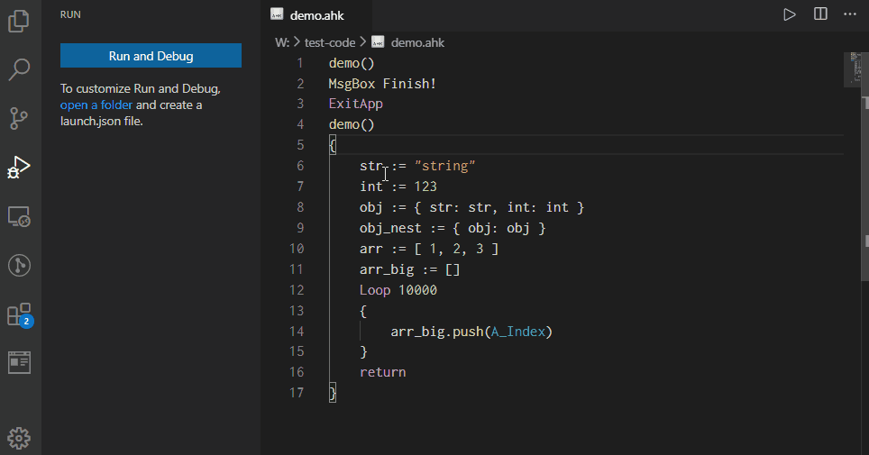

You can check the data of the variables.

#### About VariableName
If you see `VariableName` in this document, it's the name of the variable displayed by this feature. It is case-insensitive.

The object's child elements are the same as in the running script, and can be specified in dot syntax or array indexing syntax. Which method is available depends on the version of AutoHotkey, v1 can use either method. e.g. `obj.field`, `obj["field"]`, `arr[1]`

#### About A_DebuggerName
This is a variable that is only set when you are debugging, and also in SciTE4AutoHotkey. By using this variable, you can write code that only runs during debugging.

### Rewriting variables


**Note that in v2, a critical error will force the script to stop if you override the [dynamic property](https://lexikos.github.io/v2/docs/Objects.htm#Custom_Classes_property).**

The value of the variable can be overridden by a primitive value.

The following values are supported.
* `String` :　e.g `"foo"`

* `Number`

    * `Integer` :　e.g. `123`

    * `Float` :　v1 treats it as a string, v2 treats it as a `Float`. e.g. `123.456`

    * `Hex` :　It will be converted to decimal before writing. That is, if the value is `0x123`, it is written as `291`. The type is treated as `Integer` e.g. `0x123`

    * `Scientific` :　In v1, it is treated as a string
On v2, it is converted to `Float`. So, `3.0e3` is written as `3000.0`. e.g. `3.0e3`, `3.0e+5`.

### Data inspection when hover
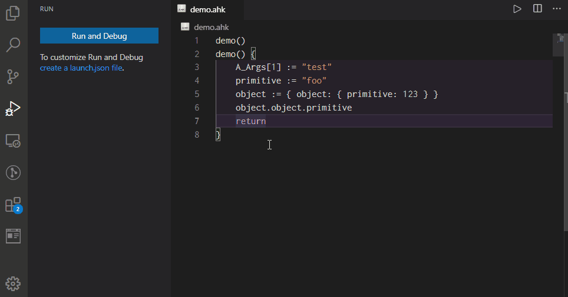

You can see the data by hovering over the name of the variable.

Only variables, and fields that use the member access syntax (e.g. `object.field`) are supported.

Due to the specification of vscode, array indexing syntax is not supported e.g. `arr[1]` and `obj["spaced key"]`.

## Call stack
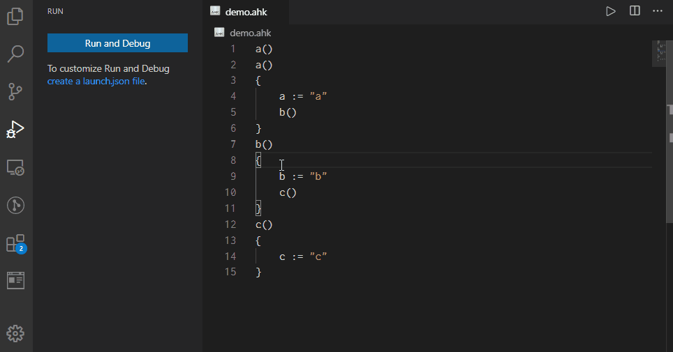

You can see the current call stack.
Also click to display the variables of that hierarchy in the [data inspection](#data-inspection).

## Watch expression
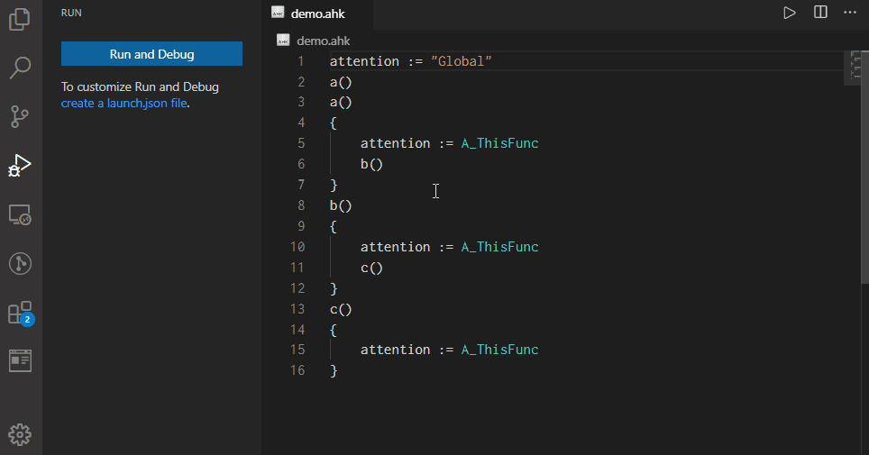

You can monitor the value of a variable. Expressions are not supported.

In addition to [VariableName](#about-variablename), you can monitor [MetaVariable](#metavariable).
Therefore, it can be used as a substitute for [PerfTips](#perftips-optional).

## Loaded scripts
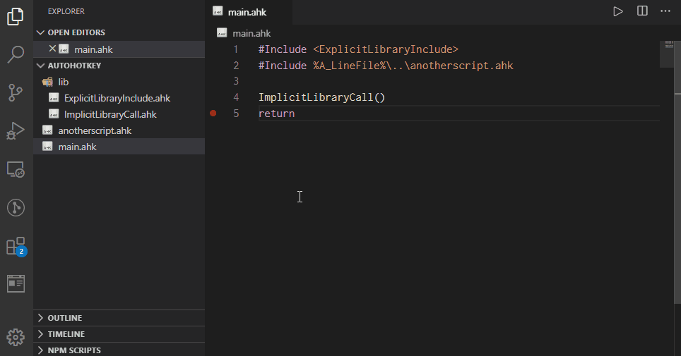

You can see the external script being loaded.

It supports both explicit loading using `#Include` and implicit loading using [function libraries](https://www.autohotkey.com/docs/Functions.htm#lib).

## Breakpoint
You can learn the basics of breakpoint [here](https://code.visualstudio.com/docs/editor/debugging#_breakpoints)

## Advanced breakpoint
**Note that using this feature for large loops will greatly degrade performance.**

See [here](https://code.visualstudio.com/docs/editor/debugging#_advanced-breakpoint-topics) for the basics.

### Conditional breakpoint
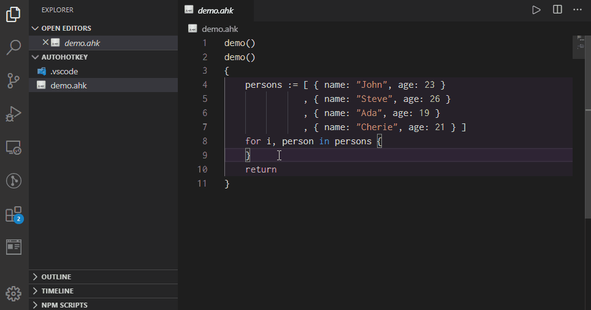

#### Condition expresion
I am not familiar with the parser and evaluation of expressions, so this is a minimal implementation.

##### Grammer
```md
# The inside of `[]` can be omitted.

Expression1 [LogicalOperator1 Expression2, LogicalOperator2 Expression3...]
```

e.g.
* `A_Index == 30`

* `20 <= person.age`

* `person.name ~= "i)J.*"`

* `100 < countof list`

* `variable is "string"`, `object is "object:Func"`, `instance is ClassObject`

* `"field" in Object`, `keyName not in Object`

* `object is Fowl || "wing" in object && "beak" in object`

##### Rules
* `Expression` :　`Operand [Operator Operand]`

* `Operand` :　`VariableName` or `Primitive`

* `VariableName` :　See [VariableName](#about-variablename) for details. e.g. `variable`, `object.field`, `object["spaced key"]`, `array[1]`

* `MetaVariableName` :　See [MetaVariable](#MetaVariable) for details. e.g. `{hitCount}`

* `Primitive` :　Primitive values for AutoHotkey. e.g. `"string"`, `123`, `123.456`, `0x123`, `3.0e3`

* `Operator`

    * Prefix operators :　 Unlike other operators, it is specify before `Operand`. Note that it is not case sensitive and requires at least one trailing space. e.g. `countof list`

        * `countof` :　If `Operand` is a primitive value, the number of characters is returned. In the case of an object, it returns the number of elements. However, in the case of an array, it returns the length

    * Logical operators :　Specify `Expression` on the left and right

        * `&&` :　Returns false if the left expression is false. If not, return right

        * `||` :　Returns true if the left expression is true. If not, return right

    * Comparison operators :　Specify `Operand` on the left and right. The `is` or `in` operator must have at least one space before and after it

        * `=` :　Equal ignore case

        * `==` :　Equal case sensitive

        * `!=` :　Not equal ignore case

        * `!==` :　Not equal case sensitive

        * `~=` :　Compare with [AutoHotkey like RegEx](https://www.autohotkey.com/docs/misc/RegEx-QuickRef.htm) or [Javascript RegExp](https://developer.mozilla.org/en-US/docs/Web/JavaScript/Guide/Regular_Expressions). e.g. `name ~= "i)j.*"`, `name ~= /j.*/i`
            * **Note** :　`AutoHotkey like RegEx` is not the same as a pure AutoHotkey regular expression(PCRE). Convert PCRE to a JavaScript RegExp using [pcre-to-regexp](https://www.npmjs.com/package/pcre-to-regexp). This means that PCRE-specific features such as (?R) are not available

        * `!~` :　The negate version of the `~=` operator

        * `>` :　Greater than

        * `>=` :　Greater than or equal

        * `<` :　Less than

        * `<=` :　Less than or equal

        * `is [not]` :　Checks if the value is of a particular type or if it inherits from a particular class. The left side is specified with `VariableName`. The right side specifies the following values. The is operator, left and right sides are all case-insensitive

            * The five basic types are as follows. These can be checked by hovering over the variable names in [Data inspection](#data-inspection). e.g. `variable is "string"`, `variable is not "undefined"`

                * `"undefined"` :　Check for uninitialized variable

                * `"string"` :　e.g. `"str"`

                * `"integer"` or `"int"` :　e.g. `123`

                * `"float"` :　e.g. `123.456`

                * `"object"` :　All values other than the primitive values. e.g. `{}`, `[]`

            * Composite types. e.g. `variable is "number"`

                * `"number"` :　Composite types of integer and float

                * `"primitive"` :　Composite types of string, integer and float

            * More detailed type check. e.g. `variable is "number:like"`, `variable is not "object:Func"`

                * `"string:alpha"` :　Checks if it consists of only the alphabet. Same as `variable ~= "^[a-zA-Z]$"`

                * `"string:alnum"` :　Checks if it consists of only the alphabet and numbers. Same as `variable ~= "^[a-zA-Z0-9]+$"`

                * `"string:hex"` :　Checks if the value is in hexadecimal. Same as `variable ~= "^0x[0-9a-fA-F]+$"`

                * `"string:upper"` :　Checks if it consists of only the alphabet of uppercase. Same as `variable ~= "^[A-Z]+$"`

                * `"string:lower"` :　Checks if it consists of only the alphabet of lowercase. Same as `variable ~= "^[a-z]+$"`

                * `"string:space"` :　Checks if it consists of only the white space characters. Same as `variable ~= "^\s+$"`

                * `"string:time"` : 　Checks if it can be interpreted as a date. A date is a string of characters that can be parsed by [Data.parse](https://developer.mozilla.org/en-US/docs/Web/JavaScript/Reference/Global_Objects/Date/parse). e.g. `2000-1-1 00:00:00`

                * `"integer:like"` or `"int:like"` :　Checks if the value can be converted to an integer or an integer. e.g. `123`, `"123"`

                * `"float:like"` or `"int:like"` :　Checks if the value can be converted to a float and not integer, or a float. Returns false if the value is an integer. e.g. `123.456`, `"123.456"`

                * `"number:like"` :　Composite types of integer:like and float:like

                * `"object:ClassName"` :　Checks whether an object is a particular `ClassName`. You can check the `ClassName` by looking at the value of the variable holding the object in [data inspection](#data-inspection)(e.g. `ClassName {...} `). Note that the `ClassName` here is not the same as the value of the `__class` field

            * `VariableName` :　Checks if the class inherits from a specific class. The value of the variable must be an class object. e.g. `instance is ClassObject`

        * `[not] in` :　Check if the object owns or inherits a particular field. Left side is `Primitive` or `VariableName`, and the right side is `VariableName`. e.g. `"key" in Object`, `"key" not in Object`

### Hit Conditional Breakpoint
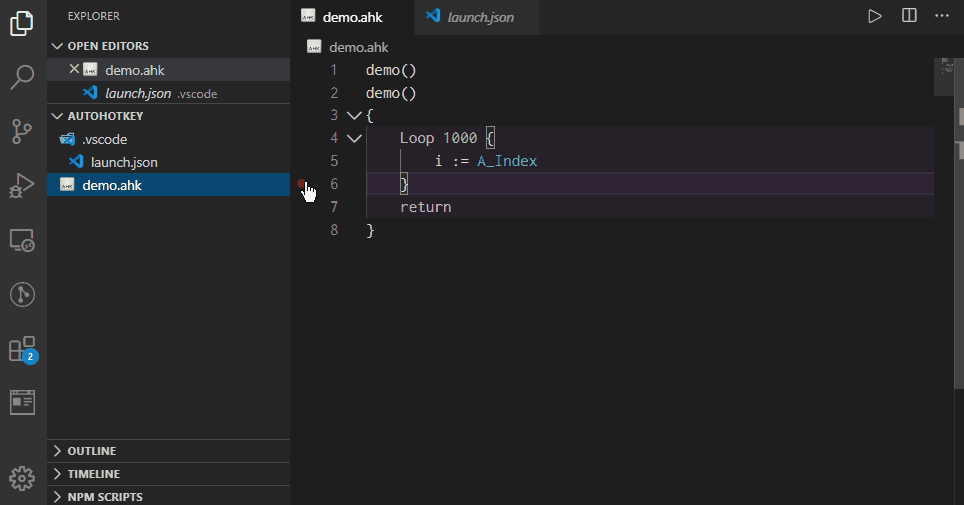

Break the script when the breakpoint reaches a certain hit count.

You can check your hit count by using [PerfTips](#perftips-optional).
Specifically, set the `usePerfTips` in launch.json to `hitCount: {{hitCount}}`.

##### Grammer
It's basically a short hand with a conditional breakpoint. However, only the `%` operator will be a unique feature.

```md
# You don't need to enter anything in {}. It is written for the purpose of explanation
# You can omit anything in []
{hitCount} [Operator] Integer
```

e.g. `= 30`, `<= 30`

##### Rules
* `hitCount` It is the same as the [MetaVariable](#metavariable)'s `{hitCount}`

* `Operator` If omitted, it is equivalent to `>=`

    * `= or ==` :　Same as `{hitCount} == Integer` by [Conditional breakpoint](#conditional-breakpoint)

    * `>` :　Same as `{hitCount} > Integer` by [Conditional breakpoint](#conditional-breakpoint)

    * `>=` :　Same as `{hitCount} >= Integer` by [Conditional breakpoint](#conditional-breakpoint)

    * `<` :　Same as `{hitCount} < Integer` by [Conditional breakpoint](#conditional-breakpoint)

    * `<=` :　Same as `{hitCount} <= Integer` by [Conditional breakpoint](#conditional-breakpoint)

    * `%` :　Same as `Mod(hitCount, Integer) == 0` by [AutoHotkey](https://www.autohotkey.com/docs/commands/Math.htm#Mod)

* `Integer` :　e.g. `30`

### Log point
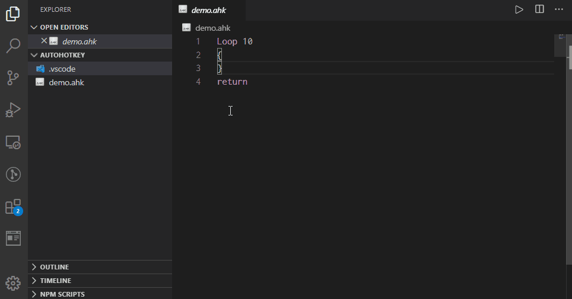

`Log point` unlike `breakpoint` do not stop the script. Instead, they output a message to the debug console.

What makes them different from traditional log output is that you don't have to modify your script. Also, you can embed variable value. Especially in the case of objects, the output is very easy to read as they are grouped.

However, you need to use VSCode's UI to use this feature, so some people may prefer to embed logging process in scripts the traditional way.
Debug directive's [Output directive](#output-directive) is useful in this case.

#### Embedding value
You can embed the [VariableName](#about-variablename) and [MetaVariable](#metavariable) value by enclosing them in curly brackets.

If you want to output `{`, use `\{`.

e.g. `count: {A_Index}`, `name: {person.name}`, `{{elapsedTime_s}}`, `\{notVariable\}`

## IntelliSense in Debugging
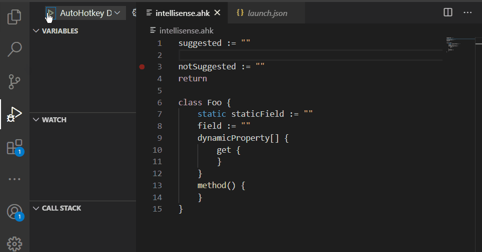

The variables that are displayed in the [Data inspection](#data-inspection) will be suggested.
Therefore, variables that have not yet been evaluated are not proposed.

This is a limited feature, but can be very useful for editing the source code while debugging.

## Debug console
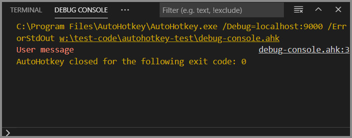
Displays various messages during debugging. Press `Ctrl + Shift + y` if you want to use it.

### Message from Debug adapter
Besides the announcements from the debug adapter, you can send messages to the debug console yourself in the following ways.
* [Log point](#log-point)
* Debug directive's [Output directive](#output-directive)

### Message from AutoHotkey
You can output messages from the AutoHotkey script to the debug console by using the following method.
* [FileAppend](https://www.autohotkey.com/docs/commands/FileAppend.htm)
* [FileOpen](https://www.autohotkey.com/docs/commands/FileOpen.htm)
* [OutputDebug](https://www.autohotkey.com/docs/commands/OutputDebug.htm)

### About error message
The debug adapter modifies the format of the file name and line number in the error messages output by AutoHotkey. This allows VSCode to recognize it as a link and allows the user to jump to the source of the error.

However, not all errors are output to the debug console and
If a runtime error occurs, the error message is basically only shown in a dialog box.
This doesn't allow you to jump to the source of the error using a link.

If this is inconvenient for you, you can include [this library](https://gist.github.com/zero-plusplus/107d88903f8cb869d3a1600db51b7b0a) in your scripts.
The library will catch all errors and output a message to the debug console in the same format as the actual error messages.

If you encounter a bug in this library, please comment at the link.

### About Multi-byte garbled characters(or mojibake)
AutoHotkey does not output multi-byte strings well.
However, in version `1.1.33.00`, the [#ErrorStdOut](https://www.autohotkey.com/docs/commands/_ErrorStdOut.htm) directive has been extended to allow output in UTF-8, which solves this problem.

It is recommended that you set the `runtimeArgs` to `[ "/ErrorStdOut=UTF-8"]` instead of using the directive.

## PerfTips (Optional)
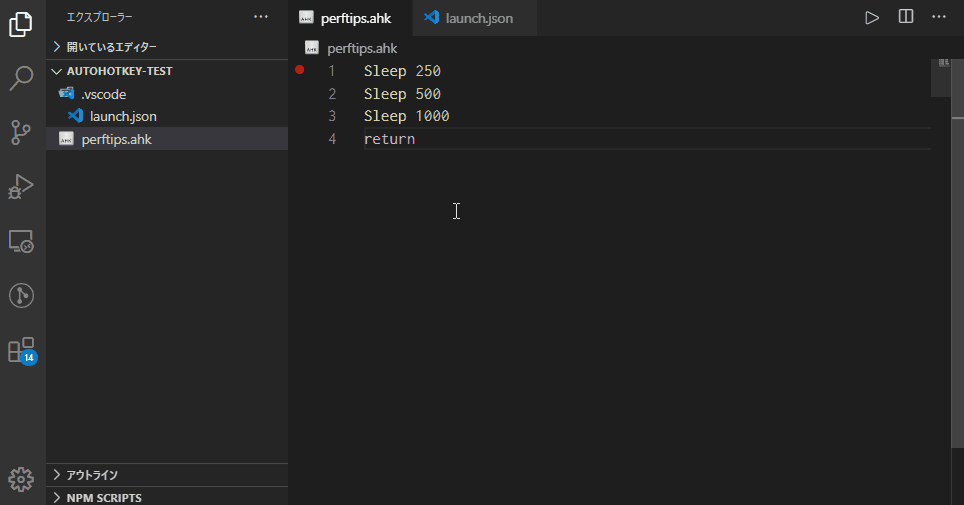

You can use it by setting `usePerfTips` in launch.json.
For more information on setting it up, see [here](#customize-launch.json).

As with Visual Studio's PerfTips, when debugging is break, the current line displays the execute time. Note that by specification, this will be slower than the actual execute time

Display more information when `useProcessUsageData` is `true`. Note, however, that this will slow down the step-execution.

Note: If you have an extension installed that displays information inline, such as `eamodio.gitlens`, it may be overwritten by that information. Currently, you need to give up one or the other. But `Metavariable` are also supported by the watch expression, so you can use that instead.

## Debug directive (Optional)
**This is a preview version. Specifications are subject to change. Also need to search for directive comments slows down performance at startup.**

You can send commands to the debugger adapter by embedding special comments into the script.

Take a look at that one, as it is implemented using [Advanced breakpoint](#advanced-breakpoint).

Each directive can be configured with the following rules.
```ahk
; @Debug-COMMAND:PARAM1:PARAM2:PARAM3...(CONDITION)[HITCONDITION] => MESSAGE
```

* `COMMAND`
    * `Breakpoint` :　See [Breakpoint directive](#breakpoint-directive)
    * `Output` :　See [Output directive](#output-directive)

* `PARAM` :　Parameters for the command. Each is described in its own section

* `CONDITION` :　See [Conditional breakpoint](#conditional-breakpoint)

* `HITCONDITION` :　See [Hit conditional breakpoint](#hit-conditional-breakpoint)

* `=>` :　Output operator
    * `->` :　Outputs the `MESSAGE` as it is
    * `=>` :　A line feed code is placed at the end of the `MESSAGE`
    * `->|` or `=>|` :　The same as for each operator, but it suppresses the automatic removal of leading whitespace

* `MESSAGE` :　See [Log point](#log-point)

### Breakpoint directive
Set a [breakpoint](#breakpoint) in the position of the directive. Unlike normal breakpoint, they are not displayed in the UI and cannot be changed.
```ahk
; @Debug-Breakpoint(CONDITION)[HITCONDITION] => MESSAGE
```

e.g. `; @Debug-Breakpoint(20 < person.age) => {person.name}`

### Output directive
Similar to the [Breakpoint directive](#breakpoint-directive), but limited to [Log point](#log-point). Instead, a grouping feature has been added.
```ahk
; @Debug-Output:GROUPING(CONDITION)[HITCONDITION] => MESSAGE
```

e.g.
```ahk
; @Debug-Output:start => {person.name}
; @Debug-Output => name: {person.name}
; @Debug-Output => age: {person.age}
; @Debug-Output:end
```

#### PARAM
1. `GROUPPING` :　You can group the output. Grouped outputs can be collapsed. Be sure to close the group with `end` as it will affect all subsequent output.
    * `start` :　Start a new group
    * `startCollapsed` :　Same as start, but the created groups will be collapsed
    * `end` :　Ends the group

# Known issues
* [Data inspection](#data-inspection) bug. Arrays with a length of 101 or more are chunked into 100 elements each. It is a specification that these headings will be displayed as `[0..99]`. The AutoHotkey array starts at 1 and should be `[1..100]`, but I can't find a way to change the headings, so I can't solve this problem at the moment

* v2 only bug. An error occurs when try to overwrite [dynamic property](https://lexikos.github.io/v2/docs/Objects.htm#Custom_Classes_property) in the [Data inspection](#data-inspection)

* If there is a conditional breakpoint that returns false immediately after the start of debugging, the pause will not work until the next stop

# Development support
## About source code contributes
I am currently not accepting contributions.

I understand that this is a folly to throw away the strength of open-source software, but I believe that I should do all the implementation because the development of this extension includes the purpose of measuring my skills as a programmer.

## About bug reports and feature requests
It is accepted on [Github issues](https://github.com/zero-plusplus/vscode-autohotkey-debug/issues). (Github account required). Basically, I will reply to you by the same day or the next day, so feel free to report.

## About GitHub Sponsors
I am looking for [GitHub Sponsors](https://github.com/sponsors/zero-plusplus) for $1-$100 per month. However, please note the following

1. There is no rewards for sponsors. This is because development is a priority.
2. I will not stop development just because I don't have a sponsor. So there is no need to be forced to become a sponsor
